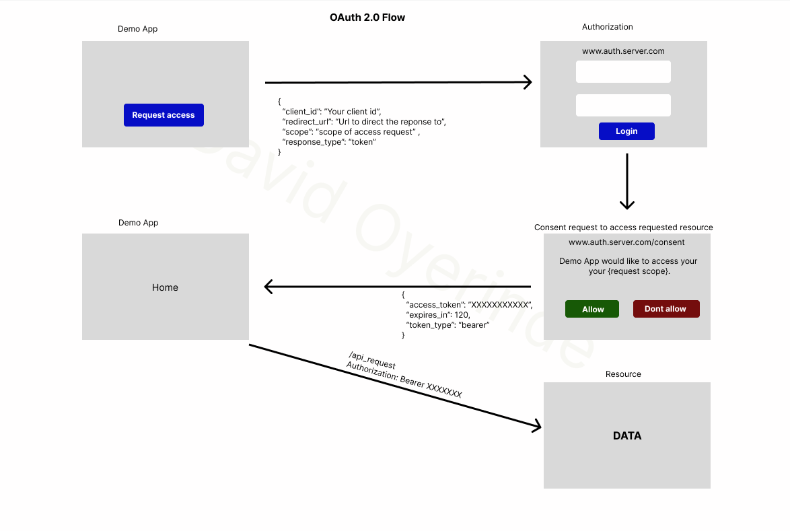

## PHP RESTFUL API

Installation guide.

Follow the instruction below:

1. Download the repo on your machine
2. The query file in the sql folder contain the database schemas
3. The data folder contains the sample data
4. The query.php can be used to add the sample data to the database

Here is an image illustrating the flow
